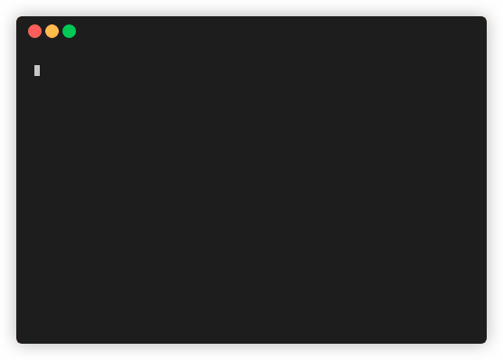

# `boyl`

`boyl` is a command-line tool written in Rust to manage template folders.

`boyl` can copy existing folders (with support for glob-like ignore patterns) to
a persistent location, and provides a terminal UI to instantiate new copies of
these templates, list the available templates, and remove templates.

[🔗 Installation](#installation)
[🔗 Is it any good?](#is-it-any-good)
[🔗 FAQ](#faq)
[🔗 Contributing](#contributing)
[🔗 Support](#support)
[🔗 License](#license)

## Installation

You can find pre-built binaries in the [releases][releases] page.

To make `boyl` accessible from the command-line, download one of the releases to
a known place (for example, `~/boyl/boyl-0.1.x`), and either add that directory
to your `$PATH`, or create a link to the executable in a directory that is
already in your `$PATH` (for example, `~/bin`):

```bash
ln -s "$HOME/boyl/boyl-0.1.x" "$HOME/bin/boyl"
```

You can confirm that `boyl` is available by running

```bash
boyl --help
```

If you wish to build `boyl` from source, you can do so with `cargo`:

```bash
cargo install --git https://github.com/mikeevmm/boyl
```

This will make `boyl` available from the command-line immediately.

[releases]: https://github.com/mikeevmm/boyl/releases

## Is it any good?

[Yes:](https://news.ycombinator.com/item?id=3067434)



## FAQ

### Why should I use `boyl` rather than cargo/npm/gradle/etc?

`boyl` is more high-level, but does not mean to replace these tools in the
first place. Language/application-specific apps to create new/boilerplate
projects will always (probably) be better picks to create new projects in
their specific domain, but they are not general purpose, and `boyl` can
customize and build on top of them (for example, you may wish to have a specific
folder structure set up, or more code than that generated by default). 

Regardless, `boyl` fills a void for languages that do not provide these tools
(*cough* C), without specializing too much.

### Why shouldn't I just `cp` my templates?

You can if you want to. `boyl` is just a glorified `cp` with some niceties on
top, anyway.

### Where are the template folders saved to?

By default, `boyl` uses the [dirs][dirs] crate to find your OS's configuration directory (e.g., `~/.config`), and saves its settings and folders to `<configuration directory>/boyl`.

You can change the used directory by setting the `BOYL_CONFIG` environment variable. Be aware that previous configuration will be lost unless you manually move existing configuration files to the new location.

[dirs]: https://lib.rs/crates/dirs

### The copy operation is very slow.

I have tried but failed to speed it up, and could not find better approaches
online. If you know what should be done, please open an issue or (preferably)
a pull request.

(Be aware that exclusion patterns mean you have to traverse the whole copied
directory; you can't just copy the base directory file.)

### Why doesn't `boyl` use NCurses?

To maximize portability; like the rest of my command line utility, I wanted
`boyl` to be usable in a setting where you only have user permissions (no
`sudo`).

After writing plenty of Rust, I know which choice I'll make next time. (Using
NCurses.)

### This code is a little janky.

Sorry about that. It's my first project in Rust. You can check out
[`template`][0], which is `boyl`'s predecessor written in Python, and is
substantially less janky code-wise (and tiny in comparison).

### Why isn't `boyl` as tiny as `template`?

Because `template` doesn't have a TUI, but also because you wouldn't believe
[the amount of code needed to accomplish in Rust what you can do in a few lines
in Python][1]. (I understand *why* this is, but it is matter-of-fact.) I am not
excellent at low-level programming, thus there might be some overhead from that
as well --- I'll leave that for you to decide.

### Isn't this basically /insert existing piece of software/?

Probably. That happens a lot, where I want some tool that does some thing and
there is already an existing tool to do that thing that I didn't go looking for.
Usually, however, I want that tool to have basically no dependencies (so I can
`curl` and `ln` it in both personal and work computers and be done), and have a
specific vision for what I want the tool to do and behave. So, instead of
finding and learning how to use tool X, I just try my hand at doing it.

I do not endorse this approach, frankly.

[0]: https://github.com/mikeevmm/template
[1]: https://xkcd.com/353/

## Contributing

Pull requests are welcome, and preferred to issues. I cannot guarantee that I
will be able to address issues. Please be polite.

## License

`boyl` is licensed under a GNU General Public License v2. This [informally means
that][tldr]:

    You may copy, distribute and modify the software as long as you track
    changes/dates in source files. Any modifications to or software including
    (via compiler) GPL-licensed code must also be made available under the GPL
    along with build & install instructions.

See LICENSE for the full text.

[tldr]: https://tldrlegal.com/license/gnu-general-public-license-v2#summary

## Support

Getting donations, no matter how small, lets me know that people use and 
appreciate the software I've put out. (Enough so to pay for it.)

If you like `boyl`, please consider [buying me a coffee][coffee].

[coffee]: https://www.paypal.me/miguelmurca/2.50